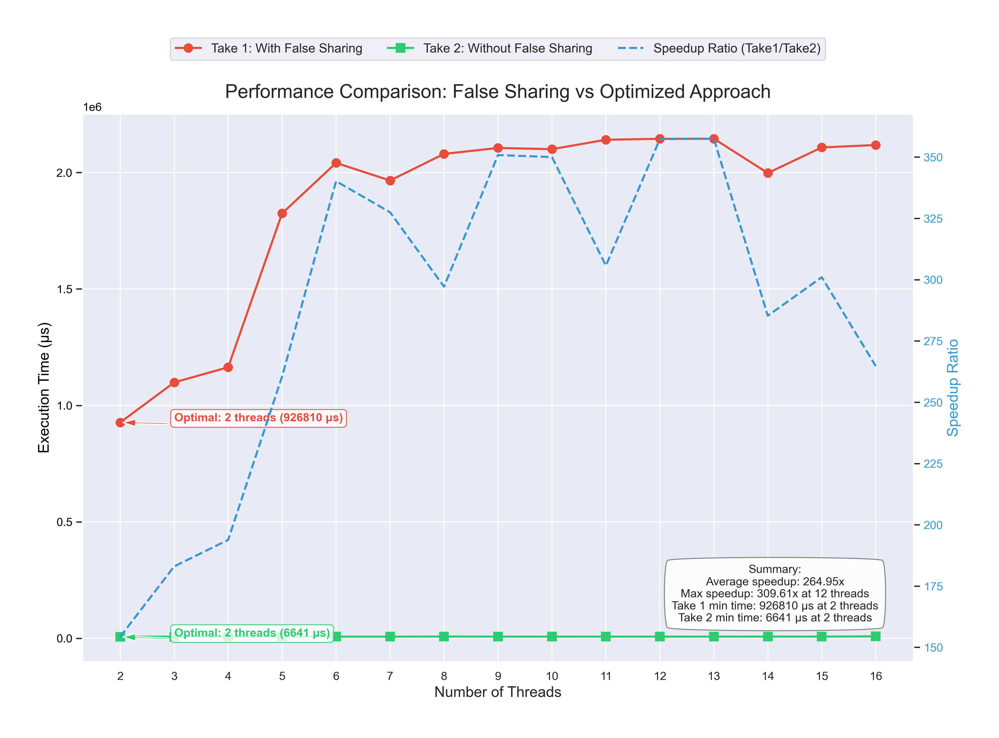
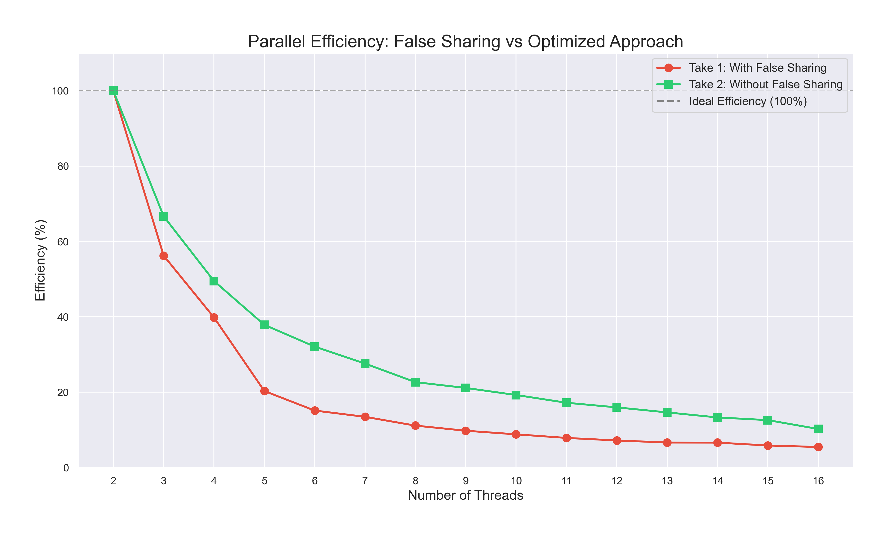

# False Sharing Benchmark

Inspired by Scott Meyers' talk: [CPU Caches and Why You Care](https://www.youtube.com/watch?v=WDIkqP4JbkE)

This project demonstrates the performance impact of false sharing in multithreaded applications. It includes a benchmark that compares two implementations of a matrix processing algorithm:

1. **With False Sharing (Take 1)**: Each thread directly updates a shared atomic counter, causing cache line invalidation.
2. **Without False Sharing (Take 2)**: Each thread uses a local counter and only updates the shared result once at the end.

## What is False Sharing?

False sharing occurs when multiple threads access different variables that happen to reside in the same cache line. Even though the threads are logically accessing different memory locations, the hardware considers them as shared due to their physical proximity in memory. This leads to excessive cache coherency traffic, where each thread repeatedly invalidates others' cached data.

This can cause performance to degrade as more threads are added, instead of improving due to parallelism.

## Benchmark Comparison

### Take 1 (with false sharing)
```cpp
// Implementation 1: With False Sharing
int runTake1(int num_threads) {
    result_take1 = new std::atomic<int>[num_threads];
    std::vector<std::thread> threads;
    int chunkSize = DIM / num_threads + 1;

    for (int p = 0; p < num_threads; ++p) {
        result_take1[p] = 0;
    }

    auto start = std::chrono::high_resolution_clock::now();

    for (int p = 0; p < num_threads; ++p) {
        threads.emplace_back([p, chunkSize]() {
            int myStart = p * chunkSize;
            int myEnd = std::min(myStart + chunkSize, DIM);
            for (int i = myStart; i < myEnd; ++i) {
                for (int j = 0; j < DIM; ++j) {
                    if (matrix[i * DIM + j] % 2 != 0)
                        ++result_take1[p];  // 🔥 False Sharing occurs here
                }
            }
        });
    }

    for (auto& t : threads) t.join();

    delete[] result_take1;
    auto end = std::chrono::high_resolution_clock::now();
    return std::chrono::duration_cast<std::chrono::microseconds>(end - start).count();
}
```

In Take 1, each thread writes to its own index in `result_take1`, but these variables are packed close together in memory. This causes different threads to contend for the same cache line, triggering expensive hardware-level cache invalidations.

### Take 2 (optimized, without false sharing)
```cpp
// Implementation 2: Without False Sharing (Optimized)
int runTake2(int num_threads) {
    result_take2.resize(num_threads);
    std::vector<std::thread> threads;
    int chunkSize = DIM / num_threads + 1;

    auto start = std::chrono::high_resolution_clock::now();

    for (int p = 0; p < num_threads; ++p) {
        threads.emplace_back([p, chunkSize]() {
            int count = 0;  // ✅ Local variable prevents false sharing
            int myStart = p * chunkSize;
            int myEnd = std::min(myStart + chunkSize, DIM);
            for (int i = myStart; i < myEnd; ++i) {
                for (int j = 0; j < DIM; ++j) {
                    if (matrix[i * DIM + j] % 2 != 0)
                        ++count;  // ✅ Local accumulation
                }
            }
            result_take2[p] = count;  // ✅ Single write to shared memory
        });
    }

    for (auto& t : threads) t.join();

    auto end = std::chrono::high_resolution_clock::now();
    return std::chrono::duration_cast<std::chrono::microseconds>(end - start).count();
}
```

Take 2 avoids false sharing by using a local variable `count` inside each thread, which is only written to shared memory once at the end. This avoids contention and enables much better scalability.

## Project Structure

- `main.cpp` - Entry point of the application
- `benchmark.h` - Header file with declarations and constants
- `benchmark.cpp` - Implementation of the benchmarking functions
- `plot_benchmark.py` - Python script to visualize benchmark results
- `Makefile` - Build automation

## Requirements

- C++17 compatible compiler (g++ recommended)
- pthread library
- Python 3 with pandas, matplotlib, seaborn, and numpy

## Building and Running

To build the project:
```bash
make
```

To run the benchmark:
```bash
make run
```

To generate plots after running the benchmark:
```bash
make plot
```

Or do everything in one step:
```bash
make clean && make plot
```

## Understanding the Results

The benchmark runs both implementations with varying thread counts and measures the execution time in microseconds. The results are written to a CSV file `benchmark_results.csv` and visualized using the Python script, which creates two charts:

1. **Performance Comparison Chart** (`benchmark_results.png`):
   - 
   - Shows execution times for both implementations
   - Displays the speedup ratio (Take1/Take2)
   - Highlights optimal thread counts for each implementation

2. **Efficiency Analysis Chart** (`efficiency_analysis.png`):
   - 
   - Shows how efficiently each implementation scales with additional threads
   - Compares against ideal linear scaling (100% efficiency)

## Interpreting the Results

- In **Take 1**, we observe that as thread count increases, the performance does not improve—
  in fact, it worsens due to severe cache line contention.
- In **Take 2**, each thread operates independently with no interference, achieving nearly ideal scaling behavior.

This shows that even if each thread writes to its own variable, performance can suffer if those variables are located within the same cache line. Optimizing for memory layout and minimizing writes to shared data are key to unlocking performance in parallel programming.

## Additional Notes

- The benchmark uses a fixed random seed for reproducibility
- All time measurements are in microseconds for higher precision
- The matrix size is defined in `benchmark.h` as 10000 x 10000 and can be adjusted for longer or shorter runs

